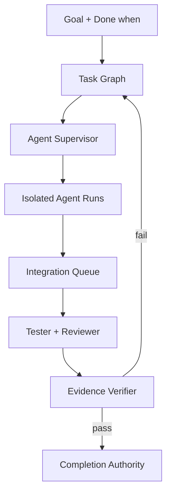

# Platform Kernel、多 Agent、Worktree 与验证闭环开发计划

> 基线：`my-ai-ui(81)`
> 文档状态：执行中
> 当前阶段：80、81 已完成；下一阶段为 82 — Integration & Review
> 最终目标：构建可恢复、可隔离、可审计、不可绕过完成门的本地 Agent 平台，并为后续 Electron 视觉验证和外部平台适配保留稳定接口。

## 1. 为什么先做 Platform Kernel

现有 `AgentRuntime` 已具备单会话执行、Tool Runtime、Plan、Checkpoint、Goal v2 和规则型完成验证，但它仍是一条与 Conversation 和窗口生命周期耦合的执行链。直接复制多个 `AgentRuntime` 会导致：

- 多个写 Agent 共享同一目录，存在静默覆盖风险；
- 任务依赖、并发预算和失败重试无法统一调度；
- Checkpoint 只能恢复单次回复，不能恢复完整后台 Job；
- 测试证据无法证明来自最终集成结果；
- 新调用路径仍可能绕过 Goal 完成判断；
- 后续增加 Reviewer、Integrator 或视觉 Agent 时需要再次重写。

因此，Platform Kernel 先提供与 UI、模型和具体 Agent 解耦的控制面。现有 Runtime 作为第一种 Worker 接入，后续再增加 Worktree Worker、Tester、Reviewer 和 Integrator。

## 2. 目标架构

平台分为四层：

1. **控制面**：PlatformRun、TaskGraph、调度、状态机、预算、暂停与取消。
2. **执行面**：AgentRun、Tool Runtime、Worktree、进程与资源租约。
3. **集成面**：Commit、集成队列、冲突处理、最终集成工作树和独立审查。
4. **证据面**：Artifact、Evidence、Review、验收标准关联和完成签名。

## 3. 不可违反的设计原则

- Journal 是恢复真相源，Snapshot 只用于加速读取。
- 所有重要状态变化必须先写 Journal，再更新快照与 UI。
- Task 和 Run 只能通过显式状态机转移，不能任意覆盖状态字段。
- 一个写资源同一时刻只有一个独占租约；共享读取不得与独占写冲突。
- Implementer 不能自行集成、审查和签发完成许可。
- Goal、代码、集成提交或验收标准变化后，旧证据与旧完成许可失效。
- 用户未提交的修改不得被平台偷偷提交、删除或覆盖。
- 到达预算或无进展边界时保存为 `continuable`，不得伪装成完成。
- 普通模式只显示可理解的摘要；详细日志、路径、哈希与 Agent 事件只在开发者模式提供。
- 外部 GitHub、云端 Worker 和定时任务通过适配器接入，不进入 Kernel 核心。

## 4. 核心数据模型

### 4.1 PlatformRun

一次 Goal 从创建到完成或取消的持久化运行容器，包含：

- `id / conversationId / goalId / goalRevision`
- `objective / mode / workspaceId`
- `status / statusReason`
- `taskGraphRevision / tasks`
- `agentRuns / artifacts / evidence / reviews`
- `completionPermit`
- `createdAt / updatedAt`

Run 状态：

`active / paused / continuable / blocked / failed / cancelled / completed`

### 4.2 TaskNode

任务图中的可调度节点，包含任务角色、依赖、输入版本、输出和验收要求。

主路径：

`pending → ready → running → review → completed`

异常状态：

`blocked / failed / cancelled / continuable`

只有全部依赖为 `completed` 的任务才能进入 `running`。

### 4.3 AgentRun

某个角色对一个 Task 的单次执行记录：

- `taskId / role / status`
- `leaseIds`
- `outcome / stopReason / error`
- `startedAt / endedAt`

79 阶段先接入现有 AgentRuntime，80–82 阶段再接入独立 Worker、Tester、Reviewer 和 Integrator。

### 4.4 ResourceLease

用于保护工作区、Worktree、端口、测试进程和其他排他资源：

- `resourceKey`
- `mode: shared | exclusive`
- `platformRunId / agentRunId`
- `acquiredAt / expiresAt / releasedAt`
- `status / releaseReason`

租约必须支持续租、显式释放、超时释放和重启孤儿回收。

### 4.5 Artifact、Evidence 与 Review

- Artifact：diff、commit、测试报告、日志、截图或构建产物。
- Evidence：Artifact 与某一条 `Done when` 的明确关联。
- Review：独立 Reviewer 对范围、风险、实现和证据的判定。

79 阶段保留结构；82–84 阶段正式写入和强制使用。

## 5. 持久化与崩溃恢复

Platform Journal 使用 JSONL 追加写，每条事件包含：

- 单调递增序号；
- 唯一事件 ID；
- 时间戳；
- 上一事件哈希；
- 当前事件哈希；
- 类型和结构化负载。

写入顺序：

1. 追加 Journal；
2. `fsync` Journal；
3. 在内存中应用事件；
4. 原子写 Snapshot；
5. 发布只读状态变更。

恢复规则：

- Snapshot 校验和失败：忽略 Snapshot，从 Journal 重放。
- Journal 尾部截断：保存损坏副本，截断到最后一条完整哈希链事件。
- 哈希链中断：停止读取可疑尾部，不把可疑事件应用到状态。
- 运行中的 Agent 在重启后变为 `interrupted`。
- 对应 Task 和 PlatformRun 变为 `continuable`。
- 过期或孤儿租约被释放，未合并修改不得因租约释放而删除。

## 6. Completion Authority

Coding Goal 不允许由 Renderer、ConversationManager 或普通 Agent 直接标记完成。

唯一完成路径：

1. Goal Verifier 返回 `verified`；
2. Platform Kernel 确认所有 Task 已结算；
3. 计算执行或集成结果哈希；
4. 计算逐条证据哈希；
5. Completion Authority 生成 HMAC 完成许可；
6. ConversationManager 验证许可后更新 Goal；
7. PlatformRun 最后进入 `completed`。

完成许可绑定：

- `goalId`
- `goalRevision`
- `platformRunId`
- `integrationHash`
- `evidenceHash`
- `verifierVersion`
- `issuedAt / scope`

修改 Goal 修订、运行 ID、执行结果或证据后，旧许可验证失败。

79 阶段的 `integrationHash` 暂时绑定 Runtime 最终工具收据；82 阶段切换为最终集成 Commit 哈希，并把后者设为 Coding Goal 的强制条件。

## 7. 版本实施路线

| 版本 | 阶段 | 核心交付 | 硬性验收门 |
|---|---|---|---|
| 79 | Platform Kernel（已完成） | PlatformRun、TaskGraph、AgentRun、Journal、Snapshot、租约、恢复、Completion Authority | 重启可恢复任务、依赖、Agent 和租约；无许可不能完成 Goal |
| 80 | Worktree Runtime（已完成） | Git 快照、Worktree 创建、租赁、归档、回收、非 Git 安全拒绝 | 两个写 Agent 无法写同一目录；未合并改动不会丢失 |
| 81 | Multi-Agent（已完成） | Supervisor、Explorer、Implementer、Tester、Reviewer、结构化交接和并发预算 | 独立任务可并行；依赖按序；失败可有限重试 |
| 82 | Integration & Review | 集成 Worktree、Commit 队列、冲突任务、独立 Reviewer | Agent 不能自行合并；冲突不覆盖；最终测试基于集成结果 |
| 83 | Local Platform | 后台队列、暂停/恢复/取消、状态 UI、Artifact 中心、通知 | 关闭窗口或异常退出后可观察并继续完整 Job |
| 84 | Verification Loop 3.0 | 失败分类、Replanner、证据关联、Reviewer 门、最终完成签名 | 集成、审查、逐条验收全部通过后才可完成 |
| 85 | Visual Verification | Electron 驱动、DOM、截图、控制台和视觉证据 | UI 标准由真实窗口交互证据证明 |
| 86 | External Platform | GitHub Issue/PR/Checks、定时任务、远程 Worker 适配器 | 外部失败不破坏本地 Kernel，一切可追踪和恢复 |

## 8. 后续阶段详细计划

### 80 — Worktree Runtime

- 检测 Git 仓库、当前分支、HEAD、脏工作区和子模块。
- 为每个写 Agent 创建独立分支和 Worktree。
- 用户脏工作区使用临时快照，不自动提交到用户分支。
- Integrator 拥有唯一集成 Worktree 写权限。
- 使用参数数组执行 Git，不拼接 Shell 命令。
- 回收前必须满足：已合并，或已保存 commit/patch；否则转为人工清理任务。
- 处理 Windows 文件锁、长路径、依赖缓存和端口冲突。
- 非 Git 工作区第一版保持单写 Agent，后续再引入隔离副本。

### 81 — Multi-Agent

首批角色：

- Planner：生成 Task Graph 和验收映射，只读。
- Explorer：检索和定位，只读。
- Implementer：在独立 Worktree 修改。
- Tester：针对指定 Commit 执行验证。
- Reviewer：独立审查最终集成结果。
- Integrator：按队列集成，不参与功能实现。

调度规则：

- 只并行无依赖且无资源冲突的任务。
- 默认 2 个 Worker，可配置到 4 个。
- 第一版不允许 Agent 递归生成子 Agent。
- 交接必须包含输入版本、输出 commit、Artifact、Evidence 和未解决问题。
- Supervisor 只调度，不直接写代码。

### 82 — Integration & Review

1. Implementer 生成 commit 和变更清单。
2. Commit 进入 Integration Queue。
3. Integrator 在集成 Worktree 依次合并。
4. 冲突创建阻塞 Task，不自动选择一方覆盖。
5. Tester 在最终集成 Commit 上重新执行验证。
6. Reviewer 检查最终 diff、范围、风险和验收覆盖。
7. 通过后 Evidence 才能进入 Completion Authority。

### 83 — Local Platform UI

- Conversation 顶层显示运行中、等待、阻塞和审查数量。
- 开发者模式展开 Task、Agent、租约、Worktree、Commit、日志和 Artifact。
- 支持暂停、继续、取消、重试和明确的人工决策点。
- `/` 面板增加 `/agents`、`/tasks`、`/worktrees`、`/run`、`/review`、`/artifacts`。
- 后台 Job 不依赖某个窗口是否打开。

### 84 — Verification Loop 3.0

- 分类实现失败、测试失败、环境失败、冲突、证据不足和需求歧义。
- 独立 Replanner 根据失败类型修改 Task Graph。
- 每条 `Done when` 必须绑定来源明确的 Artifact。
- Evidence 绑定具体 Commit、集成哈希和工具收据。
- Reviewer 与 Implementer 必须是不同 AgentRun。
- Goal、代码或集成结果变化后自动使旧证据失效。
- 无有效完成许可时，Goal 与 PlatformRun 均不能进入 `completed`。

### 85 — Visual Verification

- 启动隔离 Electron 测试实例。
- 执行真实点击、输入、窗口切换和状态恢复。
- 捕获 DOM、截图、控制台和网络错误。
- 把视觉 Artifact 绑定到具体 `Done when`。
- 失败时生成 UI 修复 Task，合并后重新启动复验。

### 86 — External Platform

- GitHub Issue/PR/Checks 适配器。
- 本地或远程定时任务适配器。
- 远程 Worker 心跳、租约和结果回传。
- 外部凭据继续使用现有安全存储，不进入 Journal、Prompt 或 Renderer。

## 9. 测试策略

每一阶段必须执行：

- 数据模型和状态机单元测试；
- 临时 Git 仓库集成测试；
- 并发、冲突、进程退出和磁盘写故障注入；
- Journal 截断、Snapshot 损坏和重启恢复测试；
- 全量 Node 回归、Lint 和生产构建；
- Electron preload smoke；
- GitHub Windows/Linux Electron E2E；
- 最终 ZIP 内容、路径和关键接线反向核验。

进入视觉阶段前必须满足：

- 两个 Agent 可在隔离 Worktree 并行修改；
- 同文件冲突不会静默覆盖；
- Agent 或应用崩溃后恢复任务、租约和证据；
- 最终测试运行于集成结果；
- 独立 Reviewer 可以拒绝完成；
- 无完成许可无法完成 Goal；
- 暂停、取消和重规划不会留下失控进程；
- 用户能看到 Task、Agent、Worktree 和阻塞原因。

## 10. 79 阶段实施记录

本轮已经实现：

- 独立于 BrowserWindow、React 和模型 SDK 的 `PlatformKernel`。
- PlatformRun、TaskNode、AgentRun 和 ResourceLease 数据结构。
- Task 依赖检查、显式状态转移和自动 `ready` 提升。
- 工作区共享/独占租约、冲突拒绝、续租、释放和超时回收。
- 带哈希链和 `fsync` 的追加式 Journal。
- 带校验和的原子 Snapshot。
- Snapshot 损坏回放、Journal 截断修复和损坏副本保留。
- 应用启动时将运行中的 Agent、Task 和 Run 恢复为可继续状态。
- HMAC Completion Authority 和 Goal v3 完成许可。
- Goal Store 迁移至 v19，保存 `revision / platformRunId / completionFingerprint`。
- 现有 AgentRuntime 作为第一个 Platform Worker 接入。
- Conversation 窗口只读 Platform IPC 和状态变更订阅接口。

79 阶段明确不包含：

- Git Worktree 的创建与回收；
- 真正的并发多 Agent Supervisor；
- Integrator、Reviewer 和最终 Commit 强制门；
- 完整后台任务 UI；
- Electron 视觉验证。

这些内容依次属于 80–85 阶段，不应在 79 的验收中被虚假标记为完成。

## 11. 80 阶段实施记录

已经实现：

- 使用临时 `GIT_INDEX_FILE` 捕获用户的 staged、unstaged 与未跟踪文件，生成不改变当前分支和真实 index 的基线提交。
- 每个 Worker 使用独立 `xixi/<run>/<agent>` 分支与独立 worktree。
- Git 进程只通过统一 `SubprocessSupervisor` 执行，参数以数组传递，不使用 Shell 拼接。
- worktree 使用 Platform 独占/共享租约，Agent 路径必须位于自己的 worktree 边界内。
- Worker 结束时自动创建 checkpoint commit；移除 worktree 后保留分支与 commit，未集成内容不会丢失。
- 创建过程采用 `creating → active → archived/retained` 两阶段记录，覆盖“Git 已创建但注册表尚未完成”的崩溃窗口。
- 启动恢复会清理临时 index，归档孤立 worktree，释放丢失 worktree 的租约。
- worktree 删除失败时状态转为 `retained`，保留路径和分支供人工处理。
- 非 Git 工作区明确返回不支持并继续使用原有单 Agent 路径，不伪造隔离能力。

80 尚不负责把多个 Worker commit 合并到最终集成分支；该职责属于 82。

## 12. 81 阶段实施记录

已经实现：

- `MultiAgentSupervisor` 按 Task 依赖和资源条件调度，默认并发 2，可配置为 1–4。
- 主模型通过真实 `delegate_tasks` Tool 发起委派；不是提示词中的虚拟 Agent。
- 单次调用最多创建 4 个有界任务，第一版 Worker 不能递归创建子 Agent。
- 独立任务使用 `Promise.all` 并行执行；依赖任务仅在前置 Task 为 `completed` 后进入 `ready`。
- Worker 使用独立 `ModelWorkerRuntime`、模型路由、Tool Session、结果目录与 worktree。
- Planner、Explorer、Tester、Reviewer 被视为只读角色；若产生文件变更，其结果会被拒绝。
- 每次 AgentRun 保存 Worker Provider/Model、attempt、worktree、输出 commit、证据、未解决问题与结构化 handoff。
- 失败任务在 `maxAttempts` 内有限重试；达到上限后 Run 转为 `continuable`，不无限循环。
- 暂停停止派发新任务；取消会中止活动 Worker 并阻止其结果被标为成功。
- Setting → Model 增加“主模型”“Worker 模型”和“Worker 并发数”，Worker 可选择与主模型不同的 Provider 和模型。

81 尚不包含最终 commit 集成、冲突任务和强制独立 Reviewer 门；这些属于 82。

## 13. 依赖安全记录

- `@modelcontextprotocol/sdk` 固定在兼容范围 `^1.29.0`，避开旧版跨客户端泄漏与 ReDoS 漏洞。
- 通过 npm `overrides` 将传递依赖 `@hono/node-server` 固定为 `2.0.11`，避开 Windows 编码反斜杠路径穿越问题。
- `package-lock.json` 已从干净状态重新生成，保证 `npm ci`、实际安装和 `npm audit` 使用同一版本。
- 不应继续运行 `npm audit fix --force`；后续先提交 lock，再用普通 `npm ci` 和 `npm audit` 验证。
